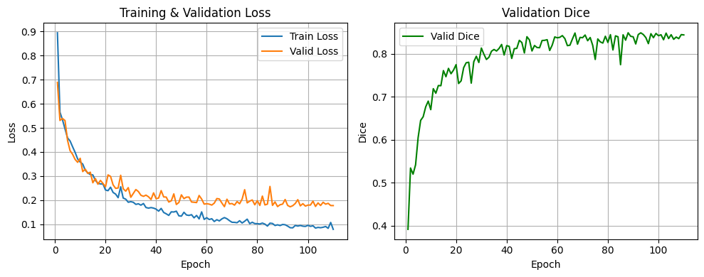
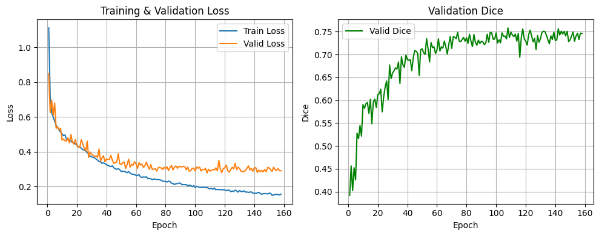
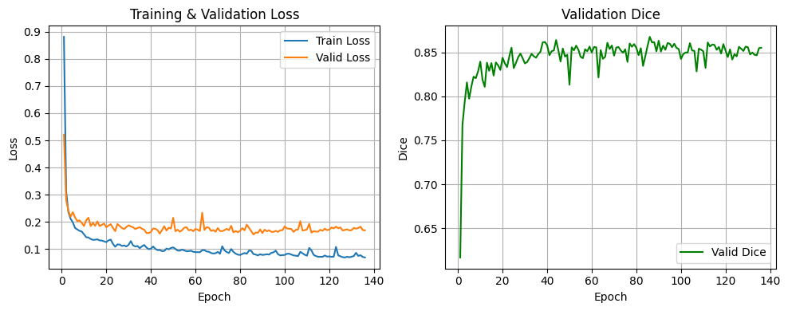

# Brain Tumor Segmentation with UNet, TransUNet, and MobileNetV3
(./logs/sample_59.png)

## **Project Overview**
This project focuses on **brain tumor segmentation** using **three different models**: **UNet, TransUNet, and MobileNetV3-based UNet**. Additionally, an **MRI classifier using ResNet50** was trained to classify MRI scans into four categories before segmentation.

### **Segmentation Models**
The three segmentation models differ in their architectural approach:

1. **UNet**: A conventional CNN-based segmentation model with an encoder-decoder structure and skip connections.
2. **TransUNet**: A hybrid model combining **transformer-based self-attention mechanisms** with a **CNN encoder**.
3. **MobileNetV3-UNet**: A lightweight **MobileNetV3** backbone integrated into a UNet-style segmentation network, aiming for efficiency with fewer parameters.

---
## **Model Training Details**

| **Parameter**  | **UNet** | **TransUNet** | **MobileNetV3-UNet** |
|---------------|---------|--------------|------------------|
| **Input Shape** | 3 × 256 × 256 | 3 × 256 × 256 | 3 × 256 × 256 |
| **Loss Function** | BCEWithLogits + Dice Loss | BCEWithLogits + Dice Loss | BCEWithLogits + Dice Loss |
| **Optimizer** | Adam (lr=1e-3) | AdamW (lr=1e-4) | Adam (lr=1e-3) |
| **Learning Rate Scheduler** | Cosine Annealing | Cosine Annealing | Cosine Annealing |
| **Batch Size** | 16 | 8 | 16 |
| **Epochs Trained** | 130 | 150 | 120 |
| **Hardware** | GPU (CUDA) | GPU (CUDA) | GPU (CUDA) |

---

## **Performance Comparison**

| **Metric**  | **UNet** | **TransUNet** | **MobileNetV3-UNet** |
|------------|---------|--------------|------------------|
| **Dice** | 0.8262 | 0.6408 | **0.8603** |
| **Jaccard** | 0.7060 | 0.4797 | **0.7565** |
| **Precision** | **0.8474** | 0.7575 | 0.8415 |
| **Recall** | 0.8141 | 0.5653 | **0.8845** |
| **F1 Score** | 0.8262 | 0.6408 | **0.8603** |

### **Observations:**
- **MobileNetV3-UNet achieved the highest Dice score (0.86)**, indicating superior segmentation accuracy.
- **UNet performed consistently well**, with a Dice score of **0.826**, proving its robustness.
- **TransUNet had the lowest performance (0.64 Dice score)**, suggesting that transformer-based segmentation requires further optimization.
- **MobileNetV3-UNet excelled in recall (0.8845)**, meaning it successfully captured more tumor regions.

---

## **Training Curves**
Below are the **training loss, validation loss, and validation Dice scores** for each model:

### **UNet**

### **TransUNet**

### **MobileNetV3-UNet**

---

## **MRI Classification with ResNet50**
To complement segmentation, a **ResNet50 classifier** was trained to categorize MRI scans into **four distinct classes before segmentation**.

### **Classifier Model Details**
- **Backbone**: Pretrained **ResNet50**
- **Final Layer**: Fully connected layer with **4 output classes**
- **Test Accuracy**: **96.72%**

---

## **Future Work**
- **Integrating the ResNet50 classifier with segmentation models** for an **end-to-end MRI analysis pipeline**.
- **Exploring post-processing techniques** like **conditional random fields (CRF)** to refine segmentation masks.
- **Further optimizing TransUNet** to improve segmentation accuracy.

---

## **Conclusion**
This study demonstrates the effectiveness of various segmentation models for brain tumor detection. **MobileNetV3-UNet showed the best performance**, balancing segmentation accuracy and computational efficiency. The addition of an MRI classifier further enhances the workflow, providing **a comprehensive tumor detection pipeline**.

