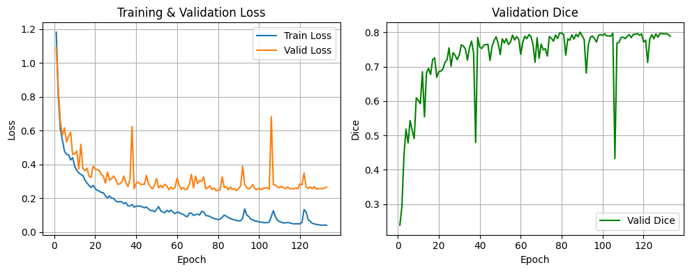
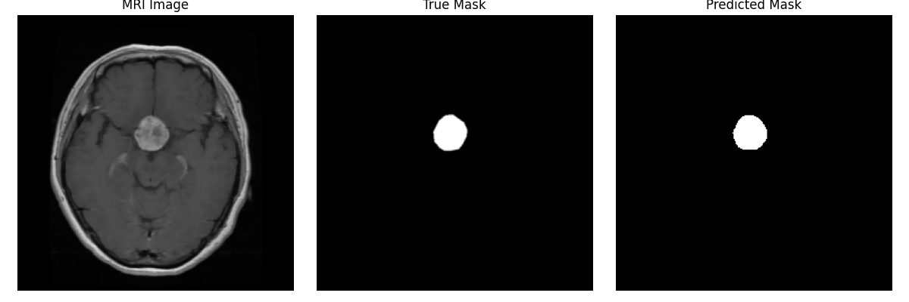

# Brain Tumor Segmentation with U-Net

## Model Overview

This project implements **brain tumor segmentation** from MRI scans using a **U-Net** architecture. The model efficiently captures both local and global spatial information through an encoder-decoder structure with skip connections.

### **Architecture Details**
- **Backbone**: U-Net with a contracting path (encoder) and expanding path (decoder).
- **Input Shape**: `3 × 256 × 256` (RGB MRI images).
- **Output**: `1 × 256 × 256` (Binary mask: tumor vs. background).
- **Loss Function**: **BCEWithLogits + Dice Loss** (for imbalanced segmentation tasks).
- **Optimizer**: **Adam** with weight decay (`1e-5`).
- **Learning Rate Schedule**: **Cosine Annealing**, starting at `1e-3`.
- **Training Configuration**:
  - Batch size: **16**
  - Number of epochs: **130**
  - Data Augmentation: **Resizing, Normalization**
  - Model Trained on: **GPU (CUDA)**
  - Best Model Checkpoint: `./models/model1/best_model.pt`

---

## **Training Performance**

The **training loss, validation loss, and validation Dice score** are shown below:

- **Training Loss** consistently decreases over time.
- **Validation Loss** stabilizes but exhibits occasional spikes, indicating possible variations in batch-wise evaluation.
- **Validation Dice** shows an **upward trend**, reaching a peak around **0.78**, indicating **strong segmentation performance**.

---

## **Test Results & Example Predictions**

The model was tested on **614 MRI images**, achieving the following average performance:

| **Metric**    | **Score**  |
|--------------|-----------|
| **Dice**     | 0.7622    |
| **Jaccard**  | 0.6653    |
| **Precision**| 0.8016    |
| **Recall**   | 0.8276    |
| **F1 Score** | 0.7622    |

### **Example Predictions**
Below are three randomly selected test cases, showing the **original MRI scan, ground truth mask, and model prediction**.

---

### **Conclusion**
- The model performs well, with a **Dice similarity of ~0.76**, indicating **strong overlap** between predictions and ground truth.
- Further improvements could involve **post-processing techniques**, **data augmentation**, or **architectural modifications** to refine predictions on challenging cases.

### **Detailed Model Architecture**

